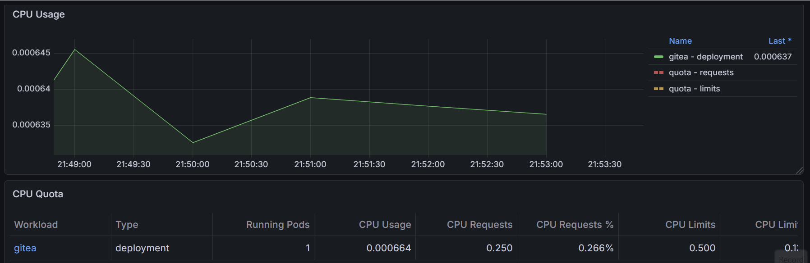

# Gitea Deployment Project

A practice project for deploying [Gitea](https://gitea.com) on Amazon EKS using Terraform to deliver 
a self-hosted Git service running on a production-grade Kubernetes cluster with 
automated CI/CD, Helm-based deployments, observability, and auto-scaling.

## Architecture

- **Cloud:** AWS
- **Orchestration:** EKS (Kubernetes 1.35)
- **IaC:** Terraform 1.15 with S3 remote state
- **CI/CD:** GitHub Actions with OIDC authentication
- **App:** Gitea with RDS MySQL backend

## Repositories

- **Infra:** This repository
- **App:** [App repo](https://github.com/almahozi/eks-gitea-app)

## Stages

### Stage 1 — EKS Cluster & Networking
- VPC with public and private subnets across 2 availability zones
- NAT Gateways for private subnet outbound traffic
- EKS cluster with managed node group (t3.small × 2)
- OIDC provider configured for IRSA

### Stage 2 — Container Image & ECR
- ECR repository provisioned via Terraform
- Custom Dockerfile wrapping official Gitea image
- GitHub Actions pipeline to build and push image to ECR

### Stage 3 — Helm Deployment & ALB
- Helm chart for Gitea deployment
- RDS MySQL backend
- Secrets injected via AWS Parameter Store and IRSA
- App exposed publicly via AWS Load Balancer Controller

### Stage 4 — CI/CD Pipeline
- Full GitHub Actions pipeline on push to main
- Image vulnerability scanning with Trivy
- Automated Helm upgrade on EKS

### Stage 5 — Observability
- Prometheus and Grafana via kube-prometheus-stack
- AlertManager rules for critical alerts

### Stage 6 — Load Testing & Auto-scaling Simulation
- Install Metrics Server for cluster resource metrics
- Configure Horizontal Pod Autoscaler (HPA) for Gitea deployment
- Load test simulation with k6 to validate auto-scaling and observability

## Auto-scaling Demo

The following Grafana capture demonstrates Gitea's HPA auto-scaling under load. CPU usage was simulated using k6 with 200 virtual users hitting multiple endpoints simultaneously.

